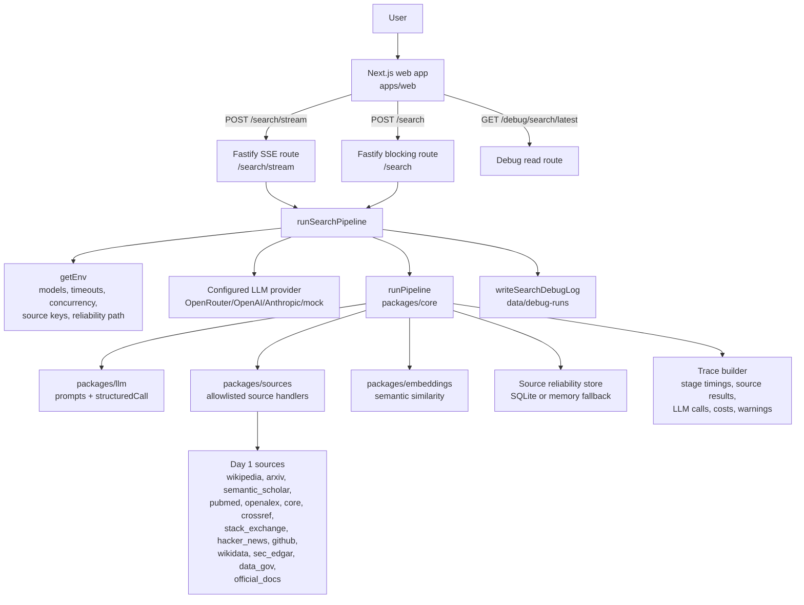
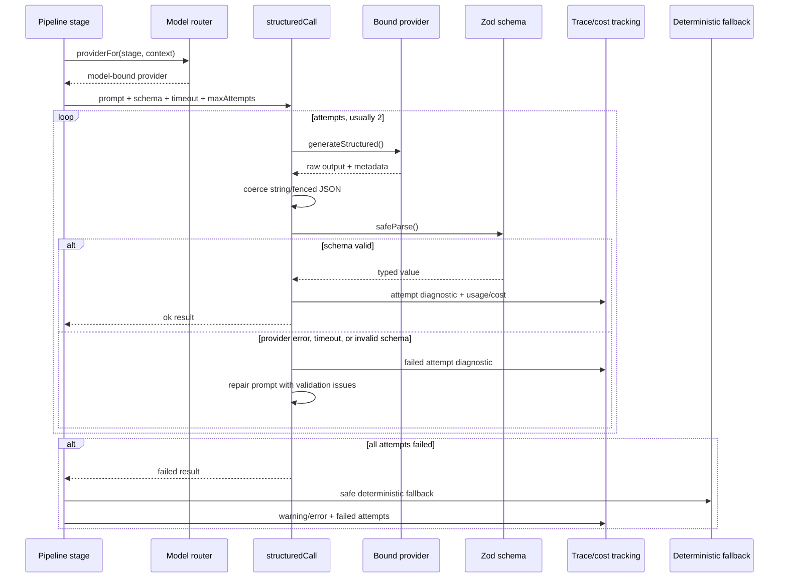
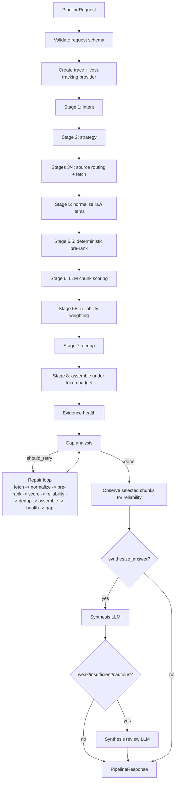

# Pipeline Runtime Tracker

This document tracks the Agent Search tool architecture, balanced-mode LLM routing, runtime instrumentation, and latest observed pipeline timing. Use it when deciding where latency is coming from or when comparing future runs against the current baseline.

## Source Of Truth

- Pipeline orchestration: `packages/core/src/pipeline/runPipeline.ts`
- Balanced-mode model routing: `packages/core/src/modelRouting.ts`
- LLM schema/repair wrapper: `packages/llm/src/structuredCall.ts`
- Stage prompts and classifications: `packages/llm/src/prompts.ts`
- Shared schemas/constants: `packages/shared/src`
- API streaming and debug-log write path: `apps/api/src/routes/search.ts`
- Web progress rendering: `apps/web/app/compare/page.tsx`
- Latest local trace artifact: `data/debug-runs/latest.json`

## Architecture Map

## Balanced-Mode Model Routing

Balanced mode selects `DEFAULT_BALANCED_STAGE_MODELS` unless env overrides or request `model_overrides` are present. Stage-specific overrides win first, then a request-level default override, then the balanced model table.

| Stage key | Default balanced model | What it does |
| --- | --- | --- |
| `intent` | `~openai/gpt-mini-latest` | Classifies the user request into `IntentObject`. |
| `strategy` | `~openai/gpt-mini-latest` | Creates source-aware `SubQuery` objects. |
| `scoring` | `~google/gemini-flash-latest` | Scores pre-ranked chunks in batches. |
| `synthesis` | `openai/gpt-5.5` | Writes a cited answer from selected chunks with reasoning enabled in balanced mode. |
| `adjudicator` | `openai/gpt-5.5` | Reviews weak/cautious answers for gaps and citation support. |

Important behavior:

- Balanced mode does not use the quality-mode escalation path for strategy/scoring.
- `synthesis` and `adjudicator` explicitly do not escalate via `shouldEscalate`.
- `createModelBoundProvider` binds the chosen model to the configured base provider.
- Provider aliases can resolve to versioned model IDs in call metadata.

## Structured LLM Call Lifecycle

Every LLM classification uses `structuredCall`: prompt, schema, timeout, attempts, output coercion, Zod validation, optional repair prompt, trace diagnostics, and deterministic fallback if the stage cannot get valid structured output.

## Pipeline Stages

## Classification Vocabulary

| Classification point | Output fields / labels |
| --- | --- |
| Stage 1 intent | `core_intent`, `query_type`, `entities`, `temporal_constraints`, `required_source_types` |
| `query_type` labels | `multi-hop`, `fresh-fact`, `source-attribution`, `adversarial`, `dedup-prone`, `cultural`, `academic` |
| `required_source_types` labels | `academic`, `news`, `primary-document`, `encyclopedic`, `forum`, `code`, `filing`, `government`, `medical` |
| Stage 2 strategy | `sub_query`, `target_sources`, `retrieval_intent`, `max_results` |
| `retrieval_intent` labels | `primary_evidence`, `corroborating`, `contrarian`, `definitional`, `temporal` |
| Stage 6 scoring | `relevance_to_query`, `confidence_score`, `freshness_fitness`, `surprise_score`, `claim_graph`, `epistemic_stance` |
| `claim_type` labels | `asserted`, `cited`, `quoted`, `disputed` |
| `epistemic_stance` labels | `primary_source`, `secondary_analysis`, `tertiary_summary`, `opinion`, `speculation` |
| Evidence health | `strong`, `adequate`, `weak`, `insufficient` |
| Gap analysis | `retry_retrieval`, `synthesize_cautiously`, `no_retry` |
| Synthesis review coverage | `answered`, `partially_answered`, `insufficient_evidence` |

## Timing Model

The trace exposes two related timing views:

- `trace.stage_timings_ms`: wall-clock time for each timed pipeline block.
- SSE/debug events: ordered user-facing events with timestamps; the delta between major events shows time between visible steps.

Interpretation rules:

- A stage timing includes any LLM retries, schema repair attempts, deterministic fallback work, and local post-processing inside that timed block.
- Source-result `timing_ms` values are aggregate per source across repeated source queries. They can exceed a single fetch-stage wall time because source requests are fanned out with concurrency.
- Stage 6 wall time is driven by the slowest active scoring batch in each concurrent scoring wave, not the sum of every batch duration.
- Repair rounds are sequential. Each round repeats fetch, normalize, pre-rank, score, reliability, dedup, assemble, evidence health, and gap analysis.
- Heartbeat progress messages are not separate work. They are emitted every 5s while a stage is still awaiting the underlying operation.

## Latest Run Baseline

This baseline comes from `data/debug-runs/latest.json`.

| Field | Value |
| --- | --- |
| Request ID | `a32658a4-4224-4f8d-beab-e3ead8faf5a5` |
| Query | `What are the trade-offs between Reciprocal Rank Fusion and learned cross-encoder reranking in hybrid retrieval pipelines, and which open-source RAG implementations have published benchmarks comparing them?` |
| Quality mode | `balanced` |
| Synthesis | `true` |
| Started | `2026-05-06T15:00:08.610Z` |
| Finished | `2026-05-06T15:05:09.923Z` |
| Debug written | `2026-05-06T15:05:09.930Z` |
| Events | `294` |
| Wall time | about `301.3s` |
| Sum of stage timings | `301298ms` |
| Final counts | `250 raw`, `262 normalized`, `16 scored`, `246 filtered`, `12 deduped`, `9 selected` |
| Total model tokens | `92161` |
| Total model cost | `$0.258158835` |

## Latest Run Major Event Timeline

`Elapsed` is time since trace start. `Delta` is time since the previous major event in this table.

| Elapsed | Delta | Event | Stage | Timing | Meaning |
| ---: | ---: | --- | --- | ---: | --- |
| `0.006s` | `0.006s` | start | `stage1_intent` | - | Intent decomposition begins. |
| `4.318s` | `4.312s` | complete | `stage1_intent` | `4312ms` | One successful intent LLM call. |
| `4.318s` | `0.000s` | start | `stage2_strategy` | - | Source strategy begins immediately. |
| `64.345s` | `60.027s` | complete | `stage2_strategy` | `60027ms` | Two 30s strategy attempts timed out; deterministic fallback used. |
| `64.345s` | `0.000s` | start | `stage3_4_router_fetch` | - | Source fetching begins. |
| `72.350s` | `8.005s` | complete | `stage3_4_router_fetch` | `8005ms` | Initial source fan-out completes. |
| `72.350s` | `0.000s` | start | `stage5_normalize` | - | Normalize initial raw items. |
| `72.352s` | `0.002s` | complete | `stage5_normalize` | `2ms` | Local normalization is tiny. |
| `72.352s` | `0.000s` | start | `stage5_5_prerank` | - | Pre-rank initial chunks. |
| `72.355s` | `0.003s` | complete | `stage5_5_prerank` | `3ms` | Deterministic pruning is tiny. |
| `72.355s` | `0.000s` | start | `stage6_score` | - | Initial chunk scoring begins. |
| `89.310s` | `16.955s` | complete | `stage6_score` | `16955ms` | Two scoring batches ran with concurrency 2. |
| `89.310s` | `0.000s` | start | `stage6b_reliability` | - | Reliability weighting begins. |
| `89.311s` | `0.001s` | complete | `stage6b_reliability` | `1ms` | Local reliability adjustment. |
| `89.311s` | `0.000s` | start | `stage7_dedup` | - | Dedup begins. |
| `89.316s` | `0.005s` | complete | `stage7_dedup` | `5ms` | Small candidate set, so dedup is tiny. |
| `89.316s` | `0.000s` | start | `stage8_assemble` | - | Assembly begins. |
| `89.317s` | `0.001s` | complete | `stage8_assemble` | `1ms` | Token-budget selection is tiny. |
| `89.317s` | `0.000s` | start | `evidence_health` | - | Evidence health begins. |
| `89.317s` | `0.000s` | complete | `evidence_health` | `0ms` | Local scoring is negligible. |
| `89.318s` | `0.001s` | gap | gap analysis | - | Repair requested. |
| `89.319s` | `0.001s` | repair start | round 1 | - | Repair round 1 begins. |
| `115.162s` | `25.843s` | gap | round 1 complete | - | Round 1 fetch + score + recompute finished. |
| `115.162s` | `0.000s` | repair start | round 2 | - | Repair round 2 begins. |
| `173.479s` | `58.317s` | gap | round 2 complete | - | Round 2 dominated by one slow scoring batch with retry. |
| `173.479s` | `0.000s` | repair start | round 3 | - | Repair round 3 begins. |
| `207.391s` | `33.912s` | gap | round 3 complete | - | Round 3 dominated by scoring. |
| `207.391s` | `0.000s` | repair start | round 4 | - | Repair round 4 begins. |
| `236.800s` | `29.409s` | gap | round 4 complete | - | Gap analysis switches to cautious synthesis. |
| `236.873s` | `0.073s` | start | `synthesis` | - | Reliability observation then synthesis starts. |
| `251.295s` | `14.422s` | complete | `synthesis` | `14422ms` | Answer synthesis LLM succeeds. |
| `251.295s` | `0.000s` | start | `synthesis_review` | - | Weak/cautious evidence review begins. |
| `301.312s` | `50.017s` | complete | `synthesis_review` | `50017ms` | Two 25s review attempts timed out; deterministic cautious review used. |
| `301.318s` | `0.006s` | final | final response | - | Final SSE event emitted. |

## Latest Run Stage Timing Table

| Stage | Runtime | Why it was long or short |
| --- | ---: | --- |
| `stage1_intent_ms` | `4.312s` | One successful structured intent call. |
| `stage2_strategy_ms` | `60.027s` | Two 30s strategy attempts timed out before deterministic fallback. This is timeout-driven, not actual useful planning time. |
| `stage3_4_router_fetch_ms` | `8.005s` | Source fan-out was capped by source timeout/concurrency. Initial fetch finished around the 8s source timeout. |
| `stage5_normalize_ms` | `0.002s` | Local transformation of a small initial raw set. |
| `stage5_5_prerank_ms` | `0.003s` | Deterministic local scoring/pruning. |
| `stage6_score_ms` | `16.955s` | Two LLM scoring batches with concurrency 2; wall time tracks the slower batch. |
| `stage6b_reliability_ms` | `0.001s` | Local reliability lookup/weight adjustment. |
| `stage7_dedup_ms` | `0.005s` | Dedup over only a few scored chunks. |
| `stage8_assemble_ms` | `0.001s` | Greedy token-budget selection over a tiny deduped set. |
| `evidence_health_ms` | `0.000s` | Local arithmetic and classification. |
| `repair_1_stage3_4_router_fetch_ms` | `10.609s` | Repair fetch across additional source queries; longer than initial due source mix/retries. |
| `repair_1_stage6_score_ms` | `15.226s` | Three scoring batches with concurrency 3; slowest batch controlled wall time. |
| `repair_2_stage3_4_router_fetch_ms` | `6.691s` | Repair fetch completed under the source timeout. |
| `repair_2_stage6_score_ms` | `51.611s` | One batch hit a 30s timeout and then a 21.6s repair attempt. This is the largest Stage 6 bottleneck. |
| `repair_3_stage3_4_router_fetch_ms` | `8.671s` | Repair fetch again reached roughly source-timeout territory. |
| `repair_3_stage6_score_ms` | `25.208s` | Slowest scoring batch took 25.2s. |
| `repair_4_stage3_4_router_fetch_ms` | `8.421s` | Repair fetch stayed near source-timeout territory. |
| `repair_4_stage6_score_ms` | `20.951s` | Slowest scoring batch took 20.9s. |
| `stage8b_reliability_observe_ms` | `0.073s` | Reliability observation write/update. |
| `synthesis_ms` | `14.422s` | One successful answer synthesis LLM call. |
| `synthesis_review_ms` | `50.017s` | Two 25s review attempts timed out before deterministic cautious review. |

Tiny repair-local stages not expanded above were all local and near-zero: repair normalize `2-5ms`, repair pre-rank `1-6ms`, repair reliability `0-1ms`, repair dedup `3-24ms`, repair assemble `0-1ms`, repair evidence health `0ms`.

## Latest Run LLM Calls

| Stage | Attempts / calls | Observed models | Outcome | Runtime notes |
| --- | ---: | --- | --- | --- |
| `intent` | 1 | `openai/gpt-5.4-mini-20260317` | success | `4312ms`; alias resolved to a dated model. |
| `strategy` | 2 | `~openai/gpt-mini-latest` | timeout, timeout | `30009ms` + `30015ms`; fallback subqueries used. |
| `scoring` | 15 | mostly `google/gemini-3-flash-preview-20251217` | 14 successful attempts plus 1 timeout followed by repair success | Biggest cost/token center; one repair path caused the 51.6s round-2 score block. |
| `synthesis` | 1 | `google/gemini-3.1-pro-preview-20260219` | success | `14421ms`. |
| `adjudicator` | 2 | `openai/gpt-5.5` | timeout, timeout | `25003ms` + `25013ms`; deterministic cautious review used. |

Cost/token summary by stage:

| Stage | Calls | Tokens | Prompt | Completion | Cost |
| --- | ---: | ---: | ---: | ---: | ---: |
| `intent` | 1 | 793 | 414 | 379 | `$0.001996` |
| `strategy` | 2 | 6910 | 1618 | 5292 | `$0.024777` |
| `scoring` | 15 | 73846 | 34366 | 39480 | `$0.134267` |
| `synthesis` | 1 | 5405 | 3747 | 1658 | `$0.027116` |
| `adjudicator` | 1 costed line item | 5207 | 3420 | 1787 | `$0.070003` |

Note: `structured_llm_calls` records both adjudicator timeout attempts, but cost summary only includes provider metadata returned by the provider/cost wrapper.

## Latest Run Scoring Batches

Stage 6 is batched. Wall time for a scoring stage is roughly the slowest concurrent batch wave, not the sum of all batch rows.

| Stage label | Batch | Chunks | Kept | Filtered | Attempts | Tokens | Duration |
| --- | ---: | ---: | ---: | ---: | ---: | ---: | ---: |
| `stage6_score` | 0 | 8 | 3 | 5 | 1 | 5385 | `16.955s` |
| `stage6_score` | 1 | 4 | 0 | 4 | 1 | 3343 | `10.659s` |
| `repair_1_stage6_score` | 0 | 8 | 0 | 8 | 1 | 4486 | `12.492s` |
| `repair_1_stage6_score` | 1 | 8 | 0 | 8 | 1 | 4616 | `15.226s` |
| `repair_1_stage6_score` | 2 | 2 | 0 | 2 | 1 | 2039 | `8.086s` |
| `repair_2_stage6_score` | 0 | 8 | 0 | 8 | 2 | 7012 | `51.611s` |
| `repair_2_stage6_score` | 1 | 8 | 3 | 5 | 1 | 4328 | `6.159s` |
| `repair_2_stage6_score` | 2 | 2 | 0 | 2 | 1 | 2071 | `7.339s` |
| `repair_3_stage6_score` | 0 | 8 | 2 | 6 | 1 | 7785 | `25.208s` |
| `repair_3_stage6_score` | 1 | 8 | 2 | 6 | 1 | 4421 | `7.222s` |
| `repair_3_stage6_score` | 2 | 2 | 1 | 1 | 1 | 2973 | `10.308s` |
| `repair_4_stage6_score` | 0 | 8 | 4 | 4 | 1 | 5822 | `18.916s` |
| `repair_4_stage6_score` | 1 | 8 | 0 | 8 | 1 | 6981 | `20.951s` |
| `repair_4_stage6_score` | 2 | 2 | 0 | 2 | 1 | 3265 | `13.178s` |

## Latest Run Repair Rounds

| Round | Raw | Normalized | Scored | Filtered | Deduped | Selected | Health | Retry? | Why it continued/stopped |
| ---: | ---: | ---: | ---: | ---: | ---: | ---: | --- | --- | --- |
| 0 | 12 | 14 | 3 | 11 | 3 | 3 | adequate | true | Initial evidence still had gaps and missing facets. |
| 1 | 25 | 25 | 1 | 17 | 4 | 4 | weak | true | Evidence health degraded to weak; code/source gaps remained. |
| 2 | 49 | 51 | 3 | 15 | 7 | 6 | adequate | true | Adequate evidence, but soft source gaps and missing facets remained. |
| 3 | 81 | 85 | 5 | 13 | 10 | 7 | adequate | true | More evidence, but missing facets remained. |
| 4 | 83 | 87 | 4 | 14 | 12 | 9 | adequate | false | Max repair round reached and gap analysis switched to cautious synthesis. |

Pre-rank summary:

| Round | Broadening | Input chunks | Selected for LLM | Rejected | Duplicate groups | Duplicate rejected | Unavailable skipped |
| ---: | ---: | ---: | ---: | ---: | ---: | ---: | --- |
| 0 | 0 | 14 | 12 | 2 | 2 | 2 | `semantic_scholar`, `wikidata` |
| 1 | 0 | 25 | 18 | 7 | 0 | 0 | `semantic_scholar`, `wikidata` |
| 2 | 1 | 51 | 18 | 33 | 2 | 2 | `semantic_scholar`, `wikidata` |
| 3 | 2 | 85 | 18 | 67 | 12 | 12 | `semantic_scholar`, `wikidata` |
| 4 | 3 | 87 | 18 | 69 | 12 | 12 | `semantic_scholar`, `wikidata`, `sec_edgar` |

## Latest Run Source Results

| Source | Queried | OK | Failed | Aggregate timing | Notes |
| --- | ---: | ---: | ---: | ---: | --- |
| `arxiv` | 23 | 15 | 8 | `1.735s` | Repeated `code.toUpperCase is not a function`; retryable unknown source exception. |
| `crossref` | 19 | 14 | 5 | `53.823s` | Multiple HTTP 429 rate limits. Aggregate timing, not one wall-clock block. |
| `data_gov` | 4 | 4 | 0 | `0.652s` | Healthy. |
| `github` | 12 | 12 | 0 | `2.629s` | Healthy. |
| `official_docs` | 12 | 12 | 0 | `11.332s` | Healthy but moderate aggregate time. |
| `openalex` | 3 | 3 | 0 | `1.991s` | Healthy. |
| `sec_edgar` | 2 | 0 | 2 | `0.000s` | Missing `SEC_USER_AGENT`; skipped as missing config. |
| `semantic_scholar` | 1 | 0 | 1 | `0.261s` | HTTP 429 rate limited. |
| `stack_exchange` | 3 | 3 | 0 | `0.918s` | Healthy. |
| `wikidata` | 1 | 0 | 1 | `0.359s` | HTTP 403 unavailable. |

## Latest Run Evidence State

Final evidence health:

- Status: `adequate`
- Evidence quality score: `74`
- Evidence coverage score: `74`
- Relevance/confidence component: `69`
- Source authority component: `90`
- Coverage/diversity component: `76`
- Freshness/failure component: `53`
- Selected evidence: `9` chunks, `16` atomic claims, `3` distinct sources, `1` distinct source type
- Primary/official represented: `8`
- Missing expected source type: `code`
- Failed important sources: `semantic_scholar`, `wikidata`, `sec_edgar`

Final gap analysis:

- Status: `synthesize_cautiously`
- Retry: `false`
- Cautious synthesis: `true`
- Missing facets: `claim-level duplication`, `Bayesian reliability`
- Source type gap: `code`
- Stop reason: `critical_gaps_not_retryable`

## Current Bottleneck Reading

The latest run was not slow because local deterministic steps were expensive. Local normalize, pre-rank, reliability, dedup, assembly, and evidence health were all sub-100ms per block. The runtime was dominated by LLM timeout policy and repeated repair rounds:

1. Stage 2 consumed `60.027s` because two strategy attempts each reached the 30s timeout before fallback.
2. Repair scoring consumed `112.996s` across rounds 1-4, with round 2 alone taking `51.611s`.
3. Synthesis review consumed `50.017s` because two 25s adjudicator attempts timed out before fallback.
4. Source fetches repeatedly approached source-timeout territory in initial and repair rounds.
5. Repair rounds repeated the expensive scoring path four times because evidence stayed adequate-but-gappy rather than cleanly done.

## What To Track For Future Runs

For each future benchmark or debugging run, append a new row or section with:

- `request_id`
- query category
- quality mode
- total wall time
- event count
- stage timing sum
- Stage 2 attempts and timeout/fallback status
- Stage 6 total calls, slowest batch, retries, and scoring concurrency
- repair round count and stop reason
- synthesis and review runtime
- source failures by source and category
- final counts: raw, normalized, scored, filtered, deduped, selected
- evidence health status and gap status
- total tokens/cost

Template:

| Date | Request ID | Mode | Query type | Wall time | Events | Repair rounds | Slowest stage | Slowest LLM call | Final health | Gap status | Notes |
| --- | --- | --- | --- | ---: | ---: | ---: | --- | --- | --- | --- | --- |
| YYYY-MM-DD | `...` | `balanced` | retrieval/papers/code | `...s` | ... | ... | `...` | `...` | `...` | `...` | ... |

## Open Optimization Questions

These are tracking questions, not implementation decisions:

- Should Stage 2 have a hard wall below 10-15s before source-aware fallback starts?
- Should synthesis review be capped below 15s or run only when evidence health is below `adequate`?
- Should repair stop after adequate evidence plus only soft gaps, instead of spending all four rounds?
- Should Stage 6 fallback or partial results trigger when one scoring batch times out, rather than waiting for a full repair attempt?
- Should progress UI show the full event history with virtualized scrolling, instead of `events.slice(-18)`?
- Should source failures that are known unavailable, missing config, or rate limited be removed from later repair targeting earlier?
- Should source result aggregate timing be separated from wall-clock fetch-stage timing in the UI to avoid confusing parallel fetch cost with elapsed time?
