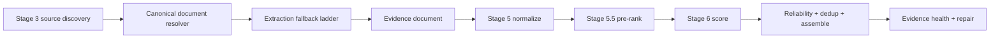

# Pre-production Readiness Implementation Plan

Created: 2026-05-06T11:08:43.7725538-05:00
Status: implementation in progress

## Summary

This pass prepares balanced mode for pre-production by improving latency, schema reliability, scoring efficiency, trace visibility, and source failure clarity without replacing the existing evidence pipeline. Balanced mode keeps the current source discovery, normalization, Stage 5.5 pre-rank, Stage 6 scoring, reliability, deduplication, evidence health, repair, synthesis, and review shape.

Provider reasoning is disabled in balanced mode for intent, Stage 2 strategy, Stage 6 scoring, and synthesis. It remains enabled only for adjudicator/synthesis review. Quality mode keeps reasoning enabled by default where the provider supports it. The Scira-style extraction ladder has now moved from future documentation into the next implemented pipeline phase.

## Status Checklist

- [x] Add this timestamped implementation tracker.
- [x] Add explicit schema instructions to structured prompts.
- [x] Disable provider reasoning in balanced mode except adjudicator/synthesis review.
- [x] Add structured-call diagnostics for reasoning enabled/disabled.
- [x] Apply balanced-mode attempt and timeout budgets.
- [x] Propagate real abort signals into timed-out structured model calls.
- [x] Reduce balanced pre-rank LLM candidates to 12 while preserving coverage behavior.
- [x] Add Stage 6 process-local scoring cache with cache diagnostics.
- [x] Add adaptive balanced repair stopping for adequate evidence plus soft gaps.
- [x] Normalize non-string source error codes.
- [x] Stop truncating live progress events.
- [x] Replace capped progress rendering with a local virtualized event timeline.
- [x] Add event detail view with timing, counts, details, errors, related trace data, and raw JSON.
- [x] Add runtime summary for wall time, stage timings, source timings, scoring batches, structured LLM calls, cache, and reasoning.
- [x] Implement bounded Scira-style canonical document resolution and extraction before normalization.
- [x] Preserve extraction metadata through raw items, normalized chunks, trace, retrieval rounds, evidence health, and Stage 6 scoring.
- [x] Fix deterministic synthesis fallback to return prose answers with inline chunk citations instead of a source/finding inventory.
- [ ] Complete unit/type/browser verification. Unit, typecheck, and build passed; browser smoke remains blocked by the in-app browser safety guard.

## Implemented Direction

Balanced mode uses one structured attempt for latency-sensitive stages. If the model does not return schema-valid JSON within the budget, the deterministic fallback handles the stage and the trace records the fallback path. The intent is to make fallback rare by making prompts explicit, while keeping it available as a hard safety boundary.

Latency budgets:

| Stage | Balanced budget | Attempts | Reasoning |
|---|---:|---:|---|
| Stage 1 intent | 8s | 1 | off |
| Stage 2 strategy | 8s | 1 | off |
| Stage 6 scoring batch | 12s | 1 | off |
| Synthesis | 15s | 1 | off |
| Synthesis review/adjudicator | 12s | 1 | on |

## Scoring Plan

Stage 6 remains the quality gate. Balanced mode now relies on a stronger Stage 5.5 pre-rank, fewer LLM-scored candidates by default, deterministic fallback, and a process-local LRU cache.

Cache key inputs:

- query fingerprint
- intent fingerprint
- chunk source, source type, title, URL, and content hash
- scorer model
- scoring prompt/schema version

The cache is intentionally process-local for this pass. It improves repair-loop and repeated-run latency without adding persistence, invalidation migrations, or cross-process cache correctness risk.

## Event Timeline And Runtime Visibility

The compare UI keeps the same compact progress box style, but all events remain accessible. The live status shimmer remains tied to the newest backend event and does not change when the user scrolls older events.

Each event detail view includes:

- event type
- stage
- source
- timestamp
- elapsed time since run start
- delta from previous event
- duration when available
- counts payload
- details payload
- error payload
- related trace timing, LLM, scoring, and source data
- raw JSON

## Source Error Normalization

Source utilities classify error codes after normalizing unknown inputs to strings. This prevents source failures such as `arxiv: code.toUpperCase is not a function` when a fetcher emits a numeric code, Error object, or structured object instead of a string.

## Extraction Ladder Implementation Phase

The extraction system now sits between source discovery and normalization. It does not replace Stage 5.5, Stage 6, reliability, deduplication, evidence health, repair, or synthesis review.



`EvidenceDocument` metadata initially flows through existing item/chunk metadata:

```ts
metadata.extraction = {
  canonical_url,
  document_type,
  retrieval_method,
  extraction_method,
  extraction_status,
  extraction_confidence,
  content_coverage,
  section_path,
  page_number,
  line_range,
  degradation_reason,
  attempts
};
```

Step 6 treatment rules:

| Extraction state | Step 6 treatment |
|---|---|
| Full text or section extracted | normal scoring |
| Structured abstract only | valid for summary-level claims, capped for detailed claims |
| Snippet/search result only | weak evidence, low confidence ceiling |
| Metadata-only | can establish existence, not claim support |
| Failed extraction | visible failure; do not silently treat as evidence |
| Browser/PDF fallback succeeded | normal scoring, with method and duration surfaced |
| Conflicting duplicate versions | canonicalize before scoring, preserve attempts |

Selected dependency decision:

- `@mozilla/readability` and `jsdom` handle bounded readable HTML extraction.
- `pdf-parse` handles bounded PDF text extraction.
- Balanced mode deepens at most 12 canonical documents per run, uses a 4s extraction fetch timeout, extraction concurrency 4, max extracted text 30k characters, and max PDF pages 8.
- Fast mode keeps the lightweight source-handler behavior unless extraction is explicitly enabled.

## Test Plan

- Unit tests for OpenRouter request body reasoning policy.
- Unit tests for real abort behavior on structured call timeout.
- Schema prompt snapshot/coverage tests for Stage 2, Stage 6, synthesis, and synthesis review.
- Stage 2 tests for one balanced attempt and deterministic fallback after timeout.
- Synthesis review tests for one balanced attempt, deterministic fallback, and draft-answer preservation when `final_answer` is missing.
- Stage 6 tests for cache hit/miss behavior, stable cache keys, fallback on timeout, required source coverage, and adaptive repair stop conditions.
- Extraction tests for canonical URL merging, readable HTML extraction, PDF extraction, metadata-only degradation, timeout/abort handling, attempt recording, and metadata propagation into normalized chunks.
- Synthesis tests for prose fallback answers with inline citations and rejection of schema-valid source inventory output.
- Source utility tests for non-string error codes.
- UI validation for all-event timeline access, event detail behavior, and independent latest shimmer status.
- Final verification with `pnpm test`, `pnpm typecheck`, and a local `/compare` balanced-mode smoke.

## Implementation Log

### 2026-05-06T11:08:43.7725538-05:00

- Started pre-production readiness implementation.
- Added reasoning policy wiring, structured-call abort propagation, schema prompt hardening, Stage 6 scoring cache, balanced repair stop logic, source error normalization, virtualized progress timeline, richer trace summary surfaces, and initial tests.

### 2026-05-06T11:13:47.4048817-05:00

- Verification update: `pnpm test` passed with 97 tests passing and 14 live tests skipped.
- Verification update: `pnpm typecheck` passed across the workspace.
- Browser verification is still pending because the in-app browser plugin blocked reload/snapshot of the already-open localhost tab with its data-URL safety guard.

### 2026-05-06T11:14:25.9126361-05:00

- Final test rerun after the UI type fix: `pnpm test` passed with 97 tests passing and 14 live tests skipped.

### 2026-05-06T11:15:19.2379829-05:00

- Build verification: `pnpm build` passed and regenerated production `dist` artifacts so runtime output matches the source fixes.

### 2026-05-06T11:52:47.6578460-05:00

- Moved the Scira-style retrieval/extraction ladder from future documentation into implementation.
- Added the `EvidenceDocument` layer, canonical document resolver, bounded HTML/PDF extraction ladder, extraction metadata propagation, extraction trace diagnostics, and degraded-extraction evidence health visibility.
- Added Stage 6 extraction treatment rules so full/section text scores normally, abstract/snippet evidence is confidence-capped, and metadata-only/failed extraction cannot support detailed claims.
- Added balanced repair support for `deepen_existing_source` before broad new retrieval when selected high-authority evidence is degraded.
- Fixed the synthesis regression where provider failure could fall back to a list-shaped answer. Deterministic synthesis now returns answer-first prose with inline chunk citations.
- Dependency decision implemented: `@mozilla/readability`, `jsdom`, and `pdf-parse`.
- Local trace improvement recorded before this phase: wall time `301.313s -> 27.414s`, events `294 -> 68`, Stage 2 `60.027s timeout/fallback -> 2.572s success`, repair rounds `4 -> 0`, Stage 6 initial scoring `16.955s -> 8.078s`, tokens `92,161 -> 9,136`, cost `$0.258158835 -> $0.011879258`.
- Remaining issue from the latest fast trace: synthesis hit provider error in `46ms` because the endpoint rejected disabled reasoning, so fallback produced a list-shaped answer. This phase fixed the fallback shape and hardened the synthesis prompt without changing model routing or balanced reasoning policy.
- Focused verification passed: `pnpm test -- packages/core/src/stage4Extraction.test.ts packages/core/src/stage5Normalize.test.ts packages/core/src/stage6Score.test.ts packages/core/src/answerSynthesis.test.ts packages/core/src/pipeline/runPipeline.test.ts` with 19 tests passing.

### 2026-05-06T11:56:17.1025777-05:00

- Full verification passed: `pnpm test` with 106 tests passing and 14 live tests skipped.
- Full verification passed: `pnpm typecheck` across the workspace.
- Full verification passed: `pnpm build` across the workspace.
- Browser smoke note: the in-app browser was on `http://localhost:3000/compare` with title `Agent Search Compare`, but reload/snapshot verification was blocked by the browser safety guard for data-URL navigation. No workaround was attempted.

### 2026-05-06T14:13:52.1552707-05:00

- Investigated request `683e8494-8deb-4d89-bbf1-48b241bfc655`.
- Root cause: balanced synthesis did not actually run. OpenRouter rejected the balanced synthesis model in `90ms` with `Reasoning is mandatory for this endpoint and cannot be disabled`, so deterministic synthesis wrote the final answer.
- Changed balanced synthesis default from `~google/gemini-pro-latest` to `~openai/gpt-mini-latest` so balanced mode keeps reasoning disabled while avoiding the provider hard-fail seen in this run.
- Strengthened deterministic synthesis for comparative questions so fallback answers the user query directly, separates RRF/fusion and learned cross-encoder reranking trade-offs, cites supporting chunks inline, and explicitly caveats when repository/code evidence is missing for open-source implementation claims.
- Focused verification passed: synthesis fallback, model routing, pipeline, and API route regression tests.

### 2026-05-06T14:41:36.2160955-05:00

- Confirmed claim-level duplicate detection, greedy marginal-gain/submodular-style selection, and Bayesian source reliability already exist in the pipeline.
- Fixed the RRF/cross-encoder facet false positive by separating rank-fusion/reranking questions from internal retrieval-architecture questions. RRF/cross-encoder questions no longer get `claim-level duplication`, `submodular selection`, or `Bayesian reliability` as required answer facets just because the query says `pipeline`.
- Added RRF/cross-encoder-specific repair facets for rank-fusion evidence, learned cross-encoder reranking, speed/quality trade-offs, and open-source benchmark evidence.
- Changed balanced synthesis to `openai/gpt-5.5` and enabled reasoning for the balanced synthesis stage only.
- Added synthesis prompt context: the call is the user-facing answer writer for an evidence engine and should turn selected, scored chunks into a direct cited answer.
- Focused verification passed for gap analysis, model routing, pipeline behavior, and API route coverage. Full `pnpm test` and workspace `pnpm typecheck` passed.

### 2026-05-07T13:37:17-05:00

- Fixed SEC EDGAR live search failures caused by the old POST body to `https://efts.sec.gov/LATEST/search-index`, which returned `HTTP 403: Missing Authentication Token`.
- Updated the SEC handler to use the working EFTS GET query shape with `q`, `from`, and `size` parameters, keep the configured SEC `User-Agent`, and normalize current EFTS response fields such as `ciks`, `display_names`, `file_description`, `file_num`, and Archives filing URLs.
- Added a regression test proving SEC uses GET query parameters and maps the current response shape.
- Confirmed local `.env` has `SEC_USER_AGENT` configured. Live source checks passed for SEC EDGAR, GitHub without token, and Semantic Scholar without key. CORE remains a controlled missing-config skip until `CORE_API_KEY` is added.
- Adjusted progress timeline severity so missing-config source skips remain visible but do not render as red errors; real HTTP, timeout, rate-limit, and unknown failures still surface as errors.
- Verification passed: `corepack pnpm --filter @agent-search/sources typecheck`, `corepack pnpm --filter @agent-search/web typecheck`, `corepack pnpm test -- packages/sources/src/sourceHandlers.test.ts`, and `corepack pnpm --filter @agent-search/web build`.
